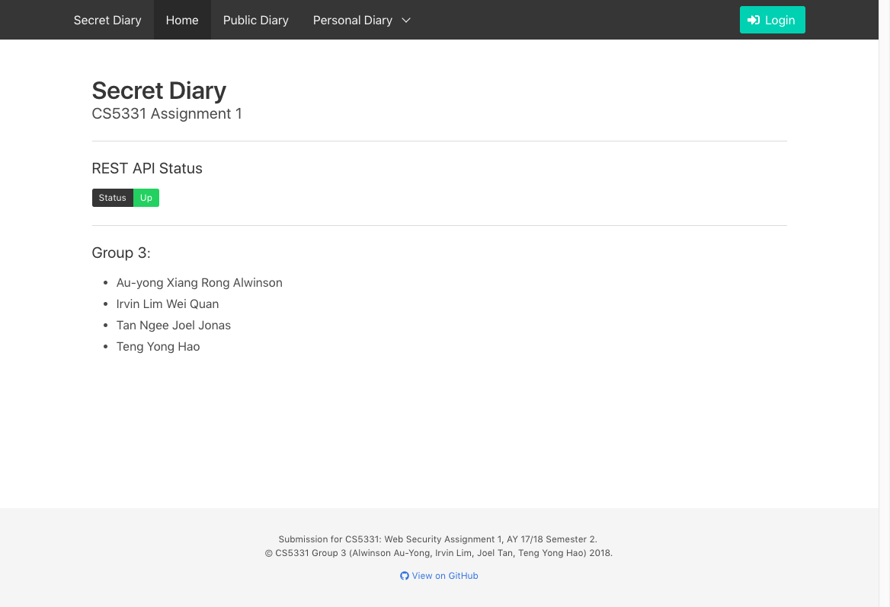
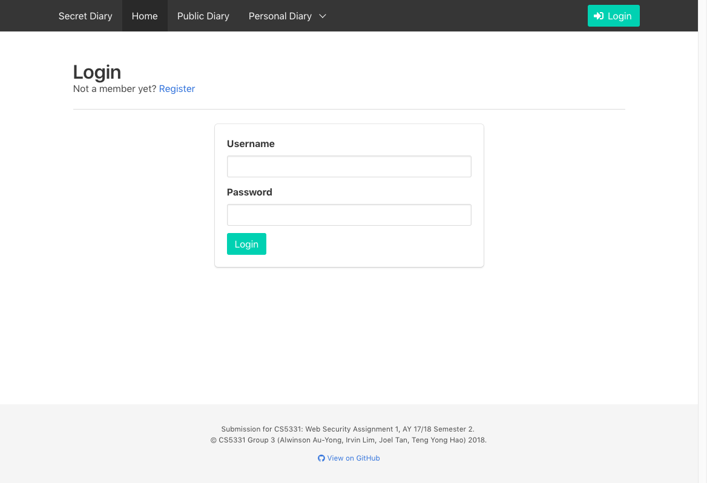
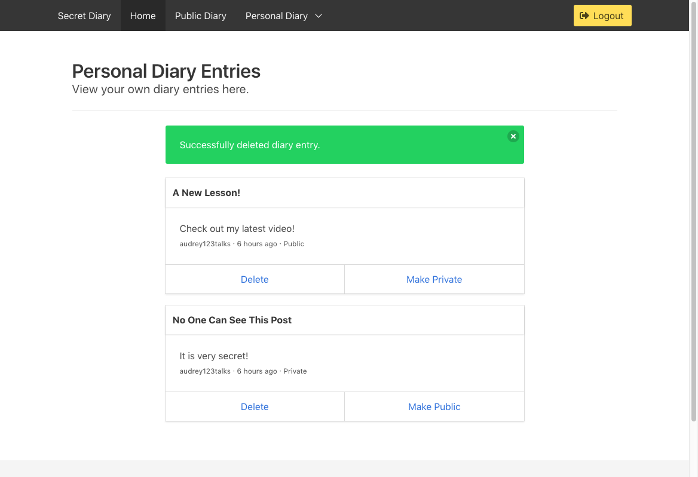
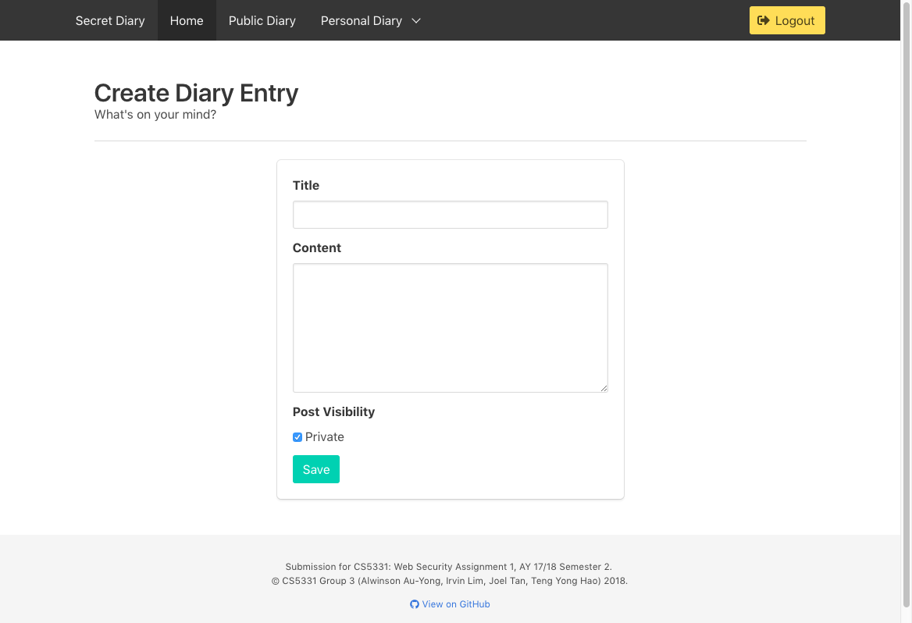

# CS5331 Assignment 1 Project: REST API Development

CS5331 Assignment 1 Project

## Team Members

1.  Au-yong Xiang Rong Alwinson
2.  Irvin Lim Wei Quan
3.  Tan Ngee Joel Jonas
4.  Teng Yong Hao

## Screenshots






## Short Answer Questions

### Question 1: Briefly describe the web technology stack used in your implementation.

#### Frontend

*   [_Vue.js_](https://vuejs.org): JavaScript view library for fast prototyping and performance
*   [_SCSS_](https://sass-lang.com/): CSS preprocessor
*   [_Webpack_](https://webpack.js.org/): Module bundler and development server for hot module reloading
*   [_Babel_](https://babeljs.io/): JavaScript transpiler

#### REST API

*   [_Express_](https://expressjs.com/): Web framework popular for REST APIs in Node.js
*   [_MongoDB_](https://www.mongodb.com/): Document store-based database server

#### Development and deployment

*   [_Docker_](https://www.docker.com/): Containerization platform for reproducible and quick builds

### Question 2: Are there any security considerations your team thought about?

#### Password security

In order to prevent rainbow table attacks, we used a random salt for each password hash, using the popular implementation `bcrypt`.

#### Authorization and policy checks

Additionally, to prevent authorization vulnerabilities, we added additional verification such that users can only modify their own diary entries, even though this was not in the specifications.

#### Injection vulnerabilities

Since we are using MongoDB, the traditional SQL injection vulnerabilities are no longer applicable. However, a lesser-known class of injection vulnerabilities do apply to NoSQL databases such as MongoDB, if the input

In order to prevent such injection attacks, we perform input sanitization at the API level, which performs type-checking and type-casting using the JavaScript [joi](https://github.com/hapijs/joi) library.

Additionally, since strings are not evaluated, arbitrary objects or JavaScript will not be evaluated, which could possibly allow for more complex queries in MongoDB such as:

```json
{ "token": "{\"$nin\": [\"A\"]}" }
```

#### Cross-site scripting

To prevent XSS, using a UI library such as Vue.js is helpful, since all UI elements are rendered on the client-side through JavaScript. Though it might be more inefficient, this new paradigm of developing frontend applications also helps to prevent XSS for the most part. Any strings that are to be rendered within the HTML are always escaped using the relevant HTML entities.

By ensuring a single source of truth of data from the API server, this prevents potential double-unescaping bugs which may result in HTML elements being rendered on the browser.

This prevents both reflected and persistent XSS, since we are escaping untrusted input when it is being displayed as HTML.

#### Cross-Origin Resource Sharing (CORS)

_TODO_

#### Cookie domains

_TODO_

#### Session ID prediction

To prevent the possibility of session ID prediction, in which an attacker can sucessfully predicts a user's session ID, our session ID are generated using a Cryptographically Secure Pseudo-Random Number Generator by using uuid version 4. Which eliminate the possibility of an attacker being able to predict a user session ID

### Question 3: Are there any improvements you would make to the API specification to improve the security of the web application?

#### Authorization checks

As previously mentioned, we believe that the policy for CRUD actions on users' diary entries should be explcitly specified. We had inferred that a user should not be able to modify other users' entries, which was not actually specified in the API specification.

#### Password complexity

There should be some explicit limits for the password length. For example, passwords should be of a considerable length in order to significantly lower the chances of brute-force attacks. Since the search space exhibits polynomial growth with respect to the length of the password, by enforcing all passwords to be at least 8 characters (for example) would prevent brute-force attacks on passwords that are length 7 or lower, whose hashes can be cracked within a reasonable amount of time on a modern computer (if the salt is known).

Additionally, password complexity should also be enforced (e.g. a combination of lower/uppercase characters, numbers and symbols) would also significantly improve the search space to lower the chances of a successful brute-force attacks.

### Question 4: Are there any additional features you would like to highlight?

#### Proxying of API server

Due to the Same-Origin policy, most modern browsers do not allow `XMLHttpRequest`s to be made across different origins (i.e. combination of protocol, domain and port number) unless Cross-Origin Resource Sharing (CORS) is explicitly allowed by the cross-origin server that is serving the remote resource.

The reason for this is to prevent unauthorised requests being made on behalf of an unsuspecting user to another website, which would then be able to either extract cookies/session data, or utilise these session data to perform actions on their behalf (e.g. banking sites).

The immediate implication for the frontend application, since it consumes a REST API via XHR, would be that the Same-Origin Policy would prevent API requests from being made, from `http://localhost:80` to `http://localhost:8080`.

The workaround would be to set up a proxy server running on port `80` that proxies any requests prefixed with `/api` to port `8080`, which does not violate the Same-Origin Policy. This was done using `webpack-dev-server`'s [`proxy` mechanism](https://webpack.js.org/configuration/dev-server/#devserver-proxy).

### Question 5: Is your web application vulnerable? If yes, how and why? If not, what measures did you take to secure it?

#### Insecure HTTP

Firstly our web application is using HTTP and not HTTPS, meaning any passive sniffer on the same network will be able to view all of the transmission and thus our "secret" diaries are not so secret anymore as it is transferred in cleartext.

Our application is also susceptible to session hijacking/user impersonation as our token is sent in cleartext, and Eve and Mallory can easily impersonate any user that is concurrently using the web application.

#### Cross-Site Request Forgery (CSRF)

_TODO_

### Feedback: Is there any other feedback you would like to give?

The REST API specification has a few oddities that are quite different from the standard REST API conventions:

*   Error status codes should not be `2xx`, but the more traditional `4xx` or `5xx` codes
*   Success status codes are arbitrarily assigned `200` or `201`
*   Not all endpoints return the results in a `result` field (_Update: This has since been rectified._)
*   Sending authentication token in `POST` body rather than either cookies or `Authorization` header
*   Unable to specify the HTTP method in the endpoint to list all endpoints (`GET /`), resulting in duplicates between `GET` and `POST` endpoints at the same URL

Also, I would have liked to see Docker Compose being allowed in this assignment, since Docker containers are meant to be of a singular, atomic purpose. This allows each of the containers to start in parallel, especially if there are several long build steps within the container.

Finally, the marks weightage for the UI is rather low at 5%, compared to the REST API at 70%, when it takes up quite a fair amount of time regardless of the frontend stack being used.

## Declaration

### Please declare your individual contributions to the assignment:

1.  Au-yong Xiang Rong Alwinson
    *   Testing and documentation
2.  Irvin Lim Wei Quan
    *   Set up Docker Compose
    *   Wrote the frontend app
    *   Set up the basic structure and endpoints for the REST API
3.  Tan Ngee Joel Jonas
    *   Testing and documentation
4.  Teng Yong Hao
    *   Set up the database connections to MongoDB
    *   Actual REST API functionality for all endpoints
